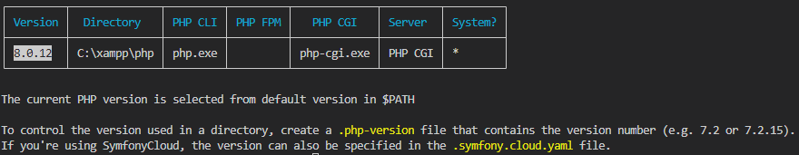
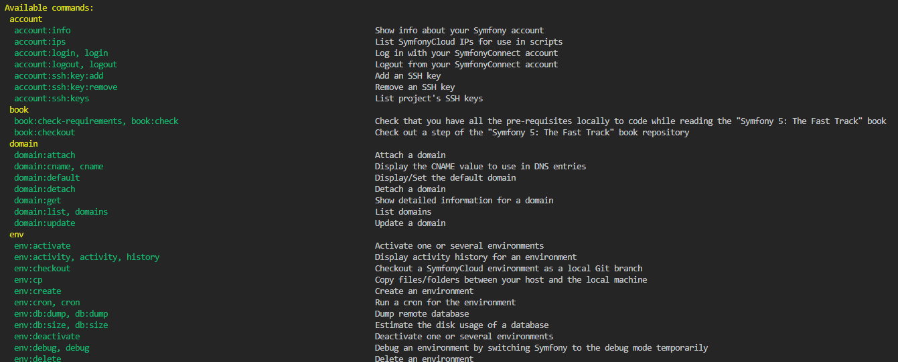

# COMMANDES UTILES
[Menu principal](../README.md)
<details>
<summary>Connaître les versions locales PHP</summary>

  ```sh
  symfony local:php:list
  ```
  Résultat :  
  
</details>
<details>
<summary>Lister les commandes Symfony</summary>

```sh
symfony local:php:list
```
Résultat :  

</details>
<details>
<summary>Démarrer un projet Symfony</summary>

```sh
symfony new --webapp NomDeLApplication
```
</details>
<details>
<summary>Lancer un serveur local</summary>

```sh
symfony server:start
```
</details>
<details>
<summary>Créer un controller</summary>

```sh
symfony make:controller
```
</details>
<details>
<summary>Créer une entité</summary>

```sh
symfony make:entity
```
</details>
<details>
<summary>Les bases de données</summary>

```sh
symfony console doctrine:database:create

symfony console make:migration
symfony console doctrine:migrations:migrate

symfony console doctrine:schema:update --dump-sql
symfony console doctrine:schema:update

```
</details>
<details>
<summary>Les tests</summary>

```sh
symfony console make:test
symfony run bin/phpunit
symfony run bin/phpunit --testdox
symfony run bin/phpunit --filter NomDuTest
symfony run bin/phpunit --filter NomDuTest | less
```
</details>
<details>
<summary>Les fixtures</summary>

```sh
composer require orm-fixtures --dev
symfony console make:fixtures
symfony console doctrine:fixtures:load

symfony run bin/phpunit || php bin/phpunit
```
</details>
<details>
<summary>Les services</summary>

```sh
// Liste les services
symfony console debug:container
```
</details>
<details>
<summary>Les commandes</summary>

```sh
symfony console make:command
composer require symfony/http-client
```
</details>
<details>
<summary>Dépendance Http Client</summary>

```sh
composer require symfony/http-client
```
</details>