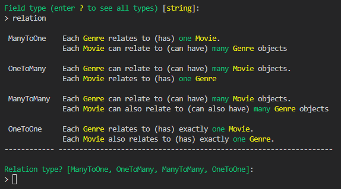
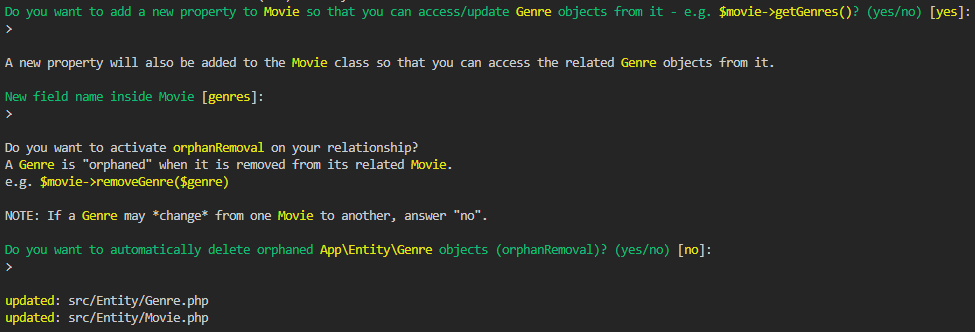

# LES ENTITY
[Menu principal](../README.md)

Il est possible d'ajouter une propriété à une `Entity`déjà crée. Pour cela, il suffit de faire la même manipulation que pour une création en indiquant que l'ont créé dans une `Entity` portant un nom déjà connu :  
```sh
symfony console make:entity NomDUneEntityDejaConnue
```

## Les relations
Lors de la création ou mise à jour d'une `Entity`, nous pouvons mettre en place les relations avec une autre *table*.  
Pour cela, lorsque la console nous demande quel est le type de la propriété que nous allons engistrer, répondre le mot clé `Relation`, il nous demande alors avec quelle autre class/table nous souhaitons établir une liaison puis le type de relation en décrivant chacunes d'entre elles :  
  

La console demandera ensuite si la propriété peut être null, si nous souhaitons générer les `getter`et `setter` dans la seconde table ainsi que le nom de sa nouvelle propriété. Enfin, il nous demande si nous souhaitons mettre en place la suppression en *cascade*  
