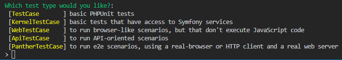
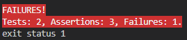
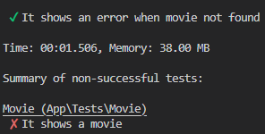

# LES TESTS
[Menu Principal](../README.md)

Il est important de mettre en place systématiquement des tests sur une application.  
Il existe deux types de tests :  
| Types | Définition |
| --- | --- |
| **unitaire** | Ils vérifient que chaque méthode et chaque fonction fonctionne correctement. Chaque test doit être aussi indépendante que possible des autres.
| **fonctionnel** | Ils sont un excellent outil pour tester votre application de bout en bout : de la requête faite par un navigateur jusqu'à la réponse envoyée par le serveur. Ils testent toutes les couches d'une application : le routage, le modèle, les actions et les Templates. Ils sont très similaires à ce que vous avez sans doute déjà fait manuellement : chaque fois que vous ajoutez ou modifiez une action, vous devez aller dans le navigateur et vérifier que tout fonctionne comme prévu en cliquant sur les liens et en vérifiant les éléments sur la page rendue. En d'autres termes, vous exécutez un scénario correspondant au cas d'utilisation que vous venez de mettre en œuvre. |

## Les tests unitaires

Si *PHPUnit* n'est pas installer :  
```sh
symfony composer req phpunit --dev
```
### Créer un test unitaire
On peut le faire directement depuis la *console*  
```sh
symfony console make:test
```
Dans notre exemple, on choisit `WebTestCase`  

Puis, on donne un nom à notre *test*

Un fichier se créé alors, où nous pouvons élaborer notre algorythme de test.  

*Il peut être également utile de mettre en place des fixtures afin de pouvoir les relier à nos test*  
*[Se rendre à la page des fixtures](./fixtures.md)*

### Utiliser un test unitaire
Il est possible d'avoir plusieurs rendus pour un même test suivant la lecture que nous souhaitons en faire.
* Lecture contractée de l'ensemble des tests existants
  ```sh
  symfony php bin/phpunit
  ```
    
Ici, deux tests ont été éxecutés avec succès vérifiant cinq assertions.
* Lecture titrée de l'ensemble des tests existants
  ```sh
  symfony php bin/phpunit --testdox
  ```
    
Ici, la réponse envoyée par la console reprend l'intitulée des méthodes de test, en se repérant grâce au CamelCase
* Lecture d'un test précis
  ```sh
  symfony php bin/phpunit --filter NomDeLaMethodeATester
  ```
  
Ici, un seul test a été éxecuté, le nombre d'assertions est bien différent

Dans le cas où un test rendrait une réponse inexacte :
* en version contractée :  
    
* en version titrée  
    
