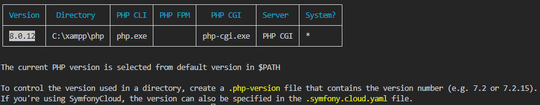

# Satrting With Symfony

## Créer un projet Symfony

Pour créer un projet Symfony, se placer dans le dossier cible puis lancer la commande
```sh
symfony new --webapp NomDuProjet
```
## L'environnement de Symfony

Nous utilisons plusieurs fichiers pour pouvoir réaliser une application Symfony :

| Dossiers | Définitions |
| --- | --- |
| `src/Controller` | Gèrent entre autre le routing ainsi que la logique entre la *requete* et la réponse à donner |
| `src/Entity` | Représente les objets de l'application |
| `src/Repository` | Recense les différentes *method* qui peuvent être appelées *(par exemple: `find()`, `finAll()`, ...)* |
| `/config`| Nous permettra de configurer notre application selon nos besoins. |
| `migrations` | Nous permettra d'avoir l'historique des différentes versions de notre base de données. |
| `templates` | Si le *front* de l'application est gérée via *Symfony*, c'est ici qu'il faudra le coder, souvent grâce à `twig` |

### Créer un `Controller`
Nous avons ici le choix entre deux commandes :
* `symfony console make:controller` : il nous demandera alors le nom du controller que nous souhaitons créer (Attention, le nom doit être au singulier et respecter le CamelCase)

* `symfony console make:controller NomDuController` : alors le controller sera créé

Il est également possible de d'apporter des spécificités telles que :
* `symfony console make:controller unDossier\NomDuController` : cela permettra de placer le controller dans le dossier souhaité
* `symfony console make:controller --no-template` : cela empêchera la génération d'un template qui lui est associé.

**Symfony**  a donc généré le controller suivant :
```php
namespace App\Controller;

use Symfony\Bundle\FrameworkBundle\Controller\AbstractController;
use Symfony\Component\HttpFoundation\Response;
use Symfony\Component\Routing\Annotation\Route;

class MovieController extends AbstractController
{
    #[Route('/movie', name: 'app_movie')]
    public function index(): Response
    {
        return $this->render('movie/index.html.twig', [
            'controller_name' => 'MovieController',
        ]);
    }
}
```
Si l'option `--no-template`n'a pas été saisie, alors un fichier s'est agalement générer dans le dossier `/templates/nomDuController`.

### Créer une Entity

## Commandes utiles
<details>
<summary>Connaître les versions locales PHP</summary>

```sh
symfony local:php:list
```
Résultat :

</details>
<details>
<summary>Lister les commandes Symfony</summary>

```sh
symfony local:php:list
```
Résultat :

</details>
<details>
<summary>Démarrer un projet Symfony</summary>

```sh
symfony new --webapp NomDeLApplication
```
</details>
<details>
<summary>Lancer un serveur local</summary>

```sh
symfony server:start
```
</details>
<details>
<summary>Créer un controller</summary>

```sh
symfony make:controller
```
</details>