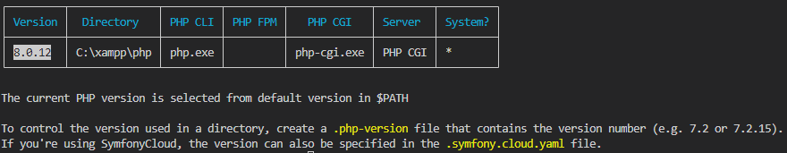
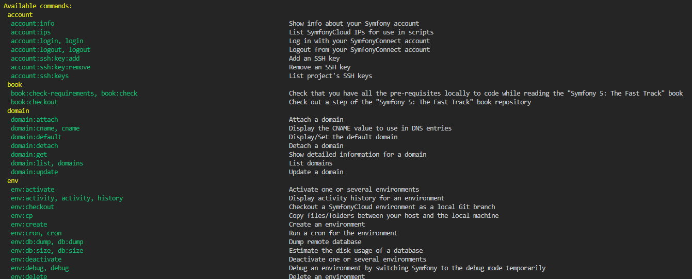

# COMMANDES UTILES
[Menu principal](./README.md)
<details>
<summary>Connaître les versions locales PHP</summary>

```sh
symfony local:php:list
```
Résultat :

</details>
<details>
<summary>Lister les commandes Symfony</summary>

```sh
symfony local:php:list
```
Résultat :

</details>
<details>
<summary>Démarrer un projet Symfony</summary>

```sh
symfony new --webapp NomDeLApplication
```
</details>
<details>
<summary>Lancer un serveur local</summary>

```sh
symfony server:start
```
</details>
<details>
<summary>Créer un controller</summary>

```sh
symfony make:controller
```
</details>
<details>
<summary>Créer une entité</summary>

```sh
symfony make:entity
```
</details>
<details>
<summary>Les bases de données</summary>

```sh
symfony console doctrine:database:create

symfony console make:migration
symfony console doctrine:migrations:migrate

symfony console doctrine:schema:update --dump-sql
symfony console doctrine:schema:update

```
</details>