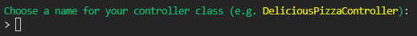

# LES BASIQUES
[Menu Principal](./README.md)
## Créer un `Controller`
Nous avons ici le choix entre deux commandes :
* `symfony console make:controller` : il nous demandera alors le nom du controller que nous souhaitons créer (Attention, le nom doit être au singulier et respecter le CamelCase)

* `symfony console make:controller NomDuController` : alors le controller sera créé

Il est également possible de d'apporter des spécificités telles que :
* `symfony console make:controller unDossier\NomDuController` : cela permettra de placer le controller dans le dossier souhaité
* `symfony console make:controller --no-template` : cela empêchera la génération d'un template qui lui est associé.

**Symfony**  a donc généré le controller suivant :
```php
namespace App\Controller;

use Symfony\Bundle\FrameworkBundle\Controller\AbstractController;
use Symfony\Component\HttpFoundation\Response;
use Symfony\Component\Routing\Annotation\Route;

class MovieController extends AbstractController
{
    #[Route('/movie', name: 'app_movie')]
    public function index(): Response
    {
        return $this->render('movie/index.html.twig', [
            'controller_name' => 'MovieController',
        ]);
    }
}
```
Si l'option `--no-template`n'a pas été saisie, alors un fichier s'est agalement générer dans le dossier `/templates/nomDuController`.

[ALLER PLUS LOIN AVEC LES CONTROLLER](./controller.md)

## Créer une `Entity`
La création d'une `Entity` générera également la création d'un `Repository`.
Une fois de plus, deux commandes permettent de créer une `Entity` :
```sh
symfony console make:entity
```
```sh
symfony console make:entity NomDeLEntity
```
**Symfony** posera alors plusieurs questions :
* Le nom de la propriété souhaité  

* Le type de la propriété. En tapant `?` une liste permettra de pouvoir orienter son choix  

* Dans le cas d'une propriété de type `string`, il demande alors la taille  

* La propriété peut-elle être `null` ?  

* Souhaitons-nous ajouter une autre propriété ? Si non, presser la toucher `ENTER` oui, noter la nom de la propriété et répondre aux questions qui s'en suivent.  


[ALLER PLUS LOIN AVEC LES ENTITY](./entity.md)